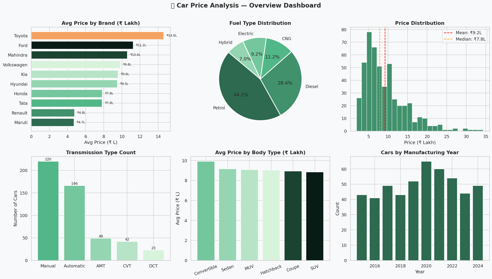
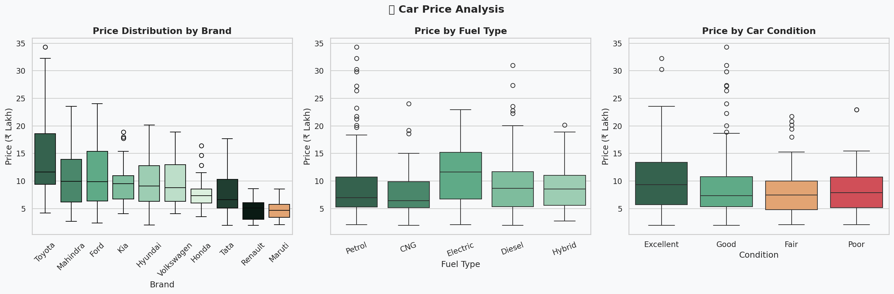
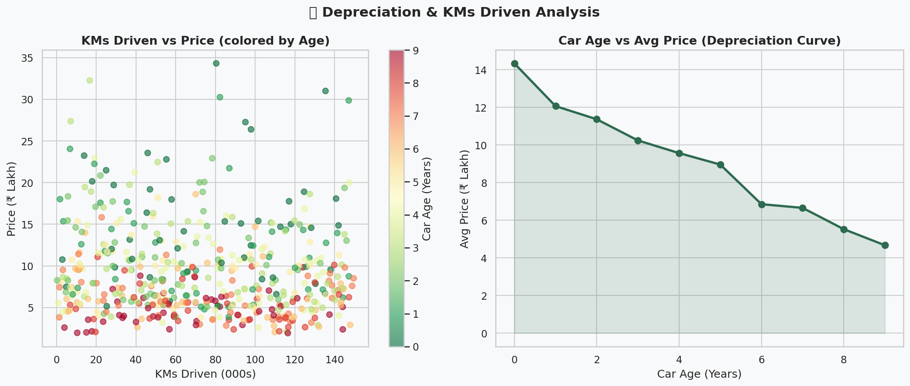
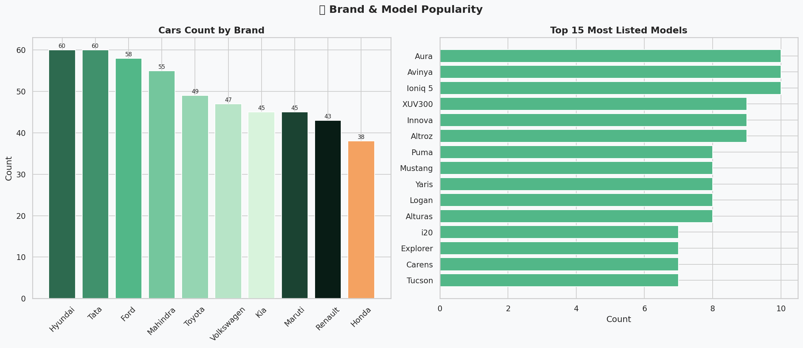
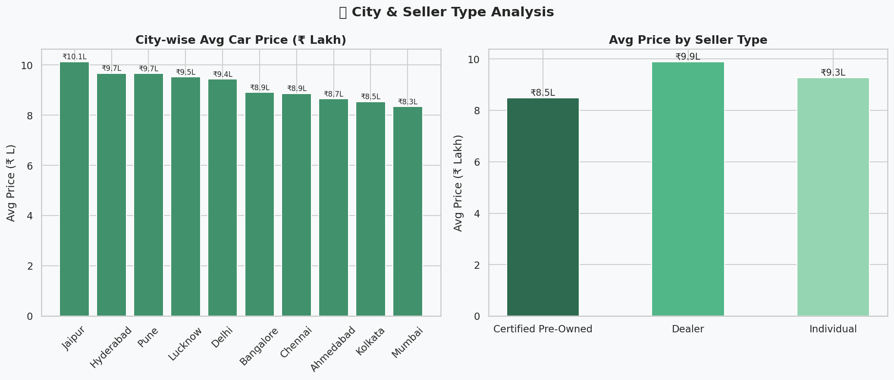
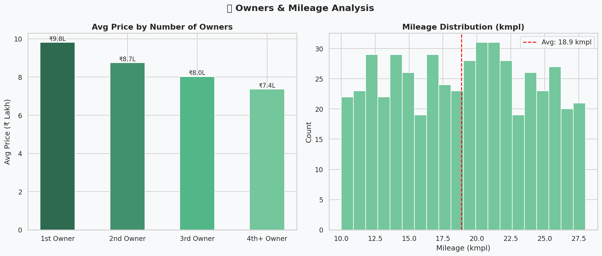
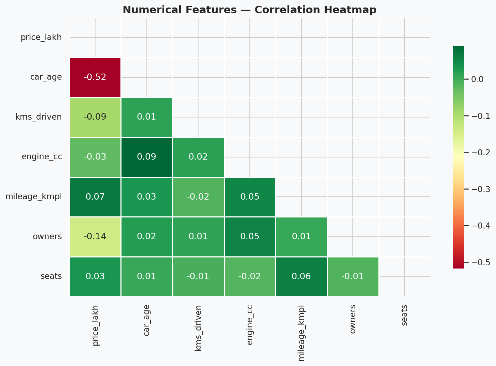

# 🚗 Car Price Analysis — Python Data Analysis Project

A complete **Car Price Analysis** project using Python.
500 Indian cars dataset with 7 visualizations and deep insights.

---

## 🎯 Project Overview

> Analyze 500 Indian cars to understand **what factors affect car prices**,
> how **depreciation works over time**, which **brands hold value best**,
> and how **KMs driven, owners, and condition** impact resale price.

---

## 📊 Key Metrics

| Metric | Value |
|--------|-------|
| 🚗 Total Cars | 500 |
| 🏷️ Total Brands | 10 |
| 🔧 Total Models | 100 |
| 💰 Price Range | ₹1.9L — ₹34.3L |
| 📊 Avg Price | ₹9.19 Lakh |
| ⛽ Most Popular Fuel | Petrol (45%) |
| 🏆 Most Listed Brand | Hyundai |
| 🛣️ Avg KMs Driven | 72,422 kms |
| 👤 1st Owner Cars | 55.8% |

---

## 📈 Analysis Sections

| # | Analysis | Insight |
|---|----------|---------|
| 1 | Overview Dashboard | Brand price, fuel type, price distribution |
| 2 | Price Analysis | Boxplots by brand, fuel, condition |
| 3 | Depreciation Curve | How price drops with age and kms |
| 4 | Brand & Model Analysis | Most popular brands and models |
| 5 | City & Seller Analysis | City-wise pricing, dealer vs individual |
| 6 | Owners & Mileage | Price drop with multiple owners |
| 7 | Correlation Heatmap | Feature relationships |

---

## 📸 Charts Preview

### 1. Overview Dashboard

### 2. Price Analysis

### 3. Depreciation Analysis

### 4. Brand & Model Analysis

### 5. City & Seller Analysis

### 6. Owners & Mileage

### 7. Correlation Heatmap

---

## 🚀 How to Run

    git clone https://github.com/MSHOHEB/car-price-analysis.git
    cd car-price-analysis
    pip install -r requirements.txt
    python car_analysis.py

---

## 📁 Project Structure

| File | Description |
|------|-------------|
| `car_prices.csv` | Dataset (500 cars, 17 features) |
| `car_analysis.py` | Complete analysis script |
| `01_overview_dashboard.png` | Overview chart |
| `02_price_analysis.png` | Price boxplots |
| `03_depreciation_analysis.png` | Depreciation curve |
| `04_brand_model_analysis.png` | Brand analysis |
| `05_city_seller_analysis.png` | City & seller |
| `06_owners_mileage_analysis.png` | Owners & mileage |
| `07_correlation_heatmap.png` | Heatmap |
| `requirements.txt` | Dependencies |
| `README.md` | Documentation |

---

## 🔍 Key Findings

| Finding | Insight |
|---------|---------|
| 💸 Price Drop | Cars lose ~7% value per year |
| 🔋 Electric Premium | EV cars 15% more expensive |
| 👤 1st Owner Value | 1st owner cars cost 25% more than 3rd owner |
| 🏙️ City Impact | Mumbai has highest avg car prices |
| ⛽ Diesel Premium | Diesel cars slightly more expensive |
| 📉 KMs Impact | Every 50k kms = ~10% price drop |
| 🏆 Toyota Tops | Toyota has highest avg resale value |

---

## 📅 Daily Development Log

| Day | Update |
|-----|--------|
| Day 1 | ✅ Created repo and README |
| Day 2 | ✅ Uploaded car_prices.csv (500 rows) |
| Day 3 | ✅ Uploaded car_analysis.py |
| Day 4 | ✅ Added requirements.txt |
| Day 5 | ✅ Uploaded Chart 1 and Chart 2 |
| Day 6 | ✅ Uploaded Chart 3 and Chart 4 |
| Day 7 | ✅ Uploaded Chart 5 and Chart 6 |
| Day 8 | ✅ Uploaded Chart 7 — Correlation Heatmap |

---

## 🛠️ Tech Stack

- **Python 3.10+** — Core language
- **Pandas** — Data manipulation & analysis
- **Matplotlib** — Charts & visualizations
- **Seaborn** — Statistical plots
- **NumPy** — Numerical computing

---
